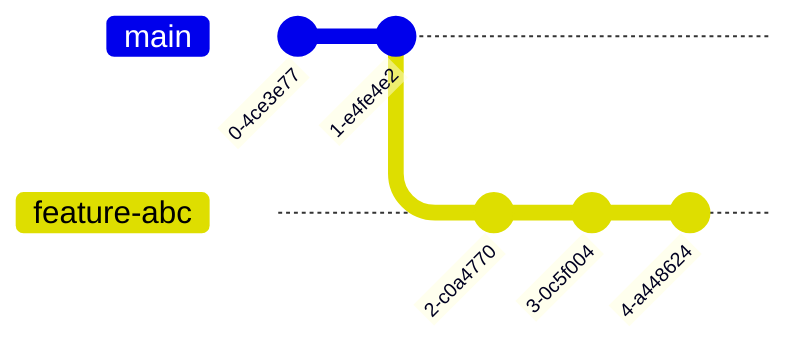

# Controls Displays

This repository contains the Graphical Interfaces to the EPICS IOCs

## Current Status

Migrating existing displays to this repository.

## Directory structure
The structure provides a system organization, grouping display files based on their purpose, while maintaining a common folder for shared resources such images. 

The test folder provides a test area for displays that require an end-to-end testing before going to a production folder.


```
controls-displays/
├── Examples
├── Templates
├── Common
├── SCL
├────── Cryomodules
│       ├── HB650      
│       └── Common
│           └──IMGS
├── TestStands
│   ├── Common
│   │  └──IMGS
|   ├── IOCTestStand
|   └── MotionControlTestStand
├── TEST 
├── LICENSE
└── README.md
```

## Contributing 

As with all contributions to the Fermilab EPICS code , one must acquire a github enterprise account so that your code may be merged with the standard deployment.

Furthermore, one must be added as a member of the controls-displays-dev team; to become a member, please make a request to Mariana González (mariana@fnal.gov), or Pierrick Hanlet (hanlet@fnal.gov).

### Local Development

You can create your own display using Phoebus, once is ready you can save it and create a Pull Request.

1- Clone this repository
2- Create a new branch, use the branch naming convention feature-abc or bugfix-xyz:
`git checkout -b feature-abc`

3- Copy your display to the correct sub-directory
4- Commit and push your changes.
<pre>
  git add [files]
  git -m "comments" commit
  git push
</pre>
5- Create a pull request.