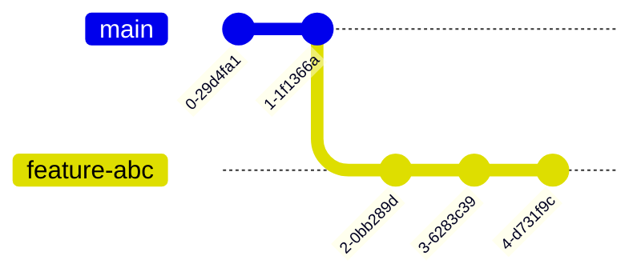
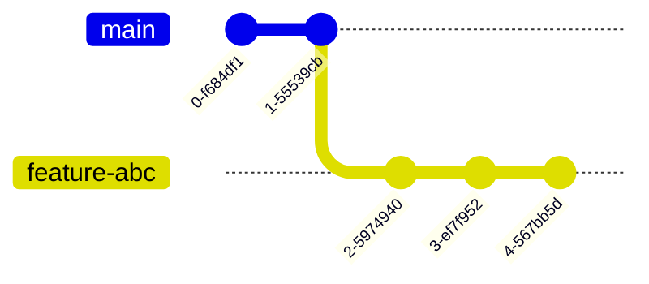

# Phoebus Displays

This repository contains the Graphical Interfaces to the EPICS IOCs consumed by Phoebus. 


## Directory structure
The structure provides a system organization, grouping display files based on their purpose, while maintaining a common folder for shared resources such images. 

The test folder provides a test area for displays that require an end-to-end testing before going to a production folder.


```
phoebus-displays/
├── Examples
├── Templates
├── Common
├── SCL
├────── Cryomodules
│       ├── HB650      
│       └── Common
│           └──IMGS
├── TestStands
│   ├── Common
│   │  └──IMGS
|   ├── IOCTestStand
|   └── MotionControlTestStand
├── TEST 
├── LICENSE
└── README.md
```

## Contributing 

This repository is public, so you can contribute even if you do not have a Fermilab GitHub Enterprise account

There are two ways to contribute:

- **Fermilab GitHub Enterprise users:** You can clone this repository, create a branch, and open a Pull Request directly.
- **Other GitHub users:** You can create a Fork of this repository, make your changes in your fork, and then open a Pull Request to this repository.


### Contributing with a Fork - non enterprise users

#### 1. Create a Fork
Open this repository on GitHub and click Fork.
This creates your own copy of the repository under your GitHub account.

#### 2. Clone your Fork
On your fork, click Code and copy the HTTPS URL.
Then, in a terminal, run:
```
git clone https://github.com/<your-username>/phoebus-displays.git
cd phoebus-displays
```
#### 3. Create a new branch, use the branch naming convention `feature-abc` or `bugfix-xyz`:

`git checkout -b feature-abc`


```mermaid
    gitGraph
       commit
       commit
       branch feature-abc
       commit
       commit
       commit
       checkout main
```

#### 4. Make Your Changes

Create or modify your Phoebus display and place the files in the appropriate directory.

Please follow the existing directory structure and naming conventions.

#### 5. Save Your Changes

Once you are satisfied with your changes, check which files were modified:

`git status`

Add your changes:

` git add <files>`

Create a commit describing your changes:
`git commit -m "Add cryomodule vacuum display"`

#### 6. Push your branch

Push your branch to your fork on GitHub:

`git push -u origin feature-abc`

#### 7. Create a Pull Request
   
Go to your fork on GitHub. GitHub should show an option to create a Pull Request for the branch you just pushed.

Select this repository as the base repository and your fork as the head repository.

Add a short description of what you changed and why, then create the Pull Request.

The repository maintainers will review your changes. They may request changes before the Pull Request is merged.

### Contributing as Fermilab GitHub Enterprise user

If you are a Fermilab GitHub Enterprise user, you can work directly with the repository instead of creating a Fork.


#### 1) Clone this repository
#### 2) Create a new branch, use the branch naming convention `feature-abc` or `bugfix-xyz`:
   
`git checkout -b feature-abc`


```mermaid
    gitGraph
       commit
       commit
       branch feature-abc
       commit
       commit
       commit
       checkout main
```
#### 3) Copy your display to the correct sub-directory
#### 4) Commit and push your changes.
```shell
  $ git add [files]
  $ git -m "comments" commit
  $ git push
```
#### 5) Create a pull request.
